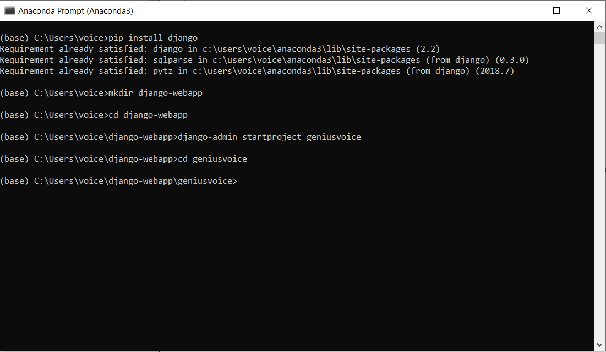
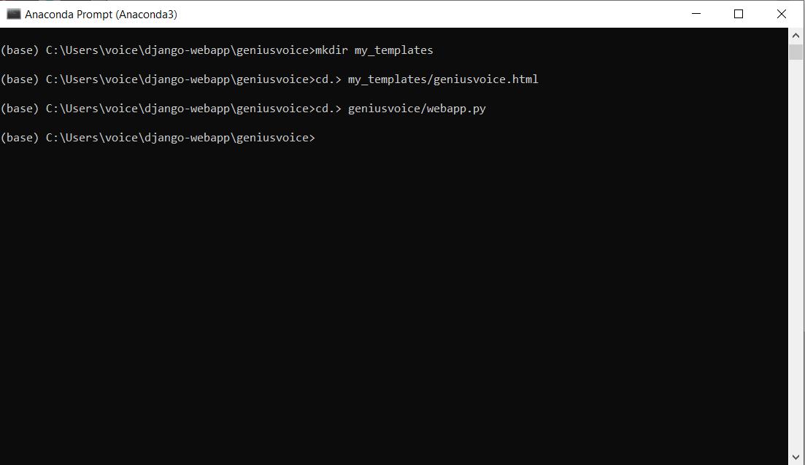

# How to click html button and run python script from a webpage

## requirements 
django

### step 1: Pip install django
```
pip install django
```

### step 2: Open your prompt window and create a directory called "django-webapp"
```
mkdir django-webapp
```

### step 3: In your prompt window, navigate to django-webapp & run django-admin startproject geniusvoice (or your own django project name)
```
cd django-webapp
django-admin startproject geniusvoice
```

### step 4: Navigate to geniusvoice
```
cd geniusvoice
```

## Checkpoint: step 1-4




### step 5: create a folder called "my_templates"
```
mkdir my_templates
```

### step 6: create a file called "geniusvoice.html" in "my_templates" folder
```
cd. > my_templates/geniusvoice.html
```

### step 7: create a file called "webapp.py" in "geniusvoice" folder
```
cd. > geniusvoice/geniusvoice.html
```

## Checkpoint: step 5-7



### step 8: Copy and paste this code in urls.py. 

NOTE: make sure to replace the existing code in urls.py

```
"""geniusvoice URL Configuration

The `urlpatterns` list routes URLs to views. For more information please see:
    https://docs.djangoproject.com/en/2.2/topics/http/urls/
Examples:
Function views
    1. Add an import:  from my_app import views
    2. Add a URL to urlpatterns:  path('', views.home, name='home')
Class-based views
    1. Add an import:  from other_app.views import Home
    2. Add a URL to urlpatterns:  path('', Home.as_view(), name='home')
Including another URLconf
    1. Import the include() function: from django.urls import include, path
    2. Add a URL to urlpatterns:  path('blog/', include('blog.urls'))
"""

from django.contrib import admin
from django.conf.urls import url
from . import webapp
urlpatterns = [
    url(r'^admin/', admin.site.urls),
    url(r'^$', webapp.button),
    url(r'^output', webapp.output,name="script"),
]
```
### step 8: Copy and paste this code in webapp.py. 

```
from django.shortcuts import render

def button(request):

    return render(request,'geniusvoice.html')

def output(request):

    output_data = "hello world"
    
    return render(request,"geniusvoice.html",{"output_data":output_data})
    
```

### step 9: Open settings.py, scroll down to "TEMPLATES" and paste 'my_templates' in the empty list

```
'my_templates'

```


### step 10: 
